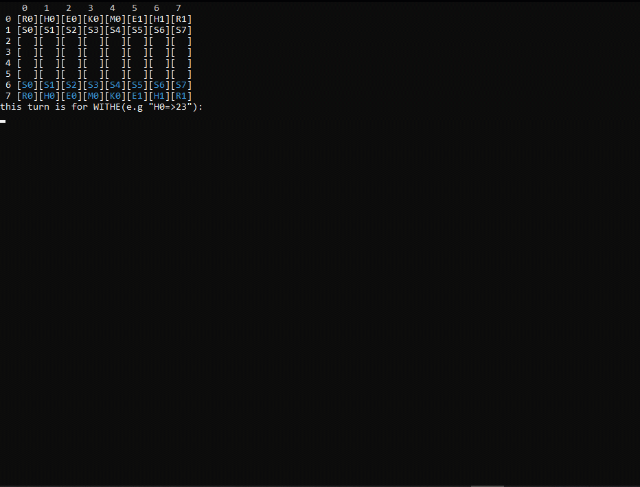

# ches
<!---->
This game created by C++ and you can run it in powershell or CMD. There are two teams such as real game, but with a little difference: the black team has the color of blue because of CMD is black and black can create many visual problem in black background.
## How to play
There is a board that update evry time.The white side is in the top of board and black side is in bottom and the first turn is for white side.
All nuts define betwen [ and ]. All nuts have an unic character,number and color.The character at the beginning of the phrase refers to the role of the nut. The number in phrase refer to the number of same type nut and creates a difference betwen other nuts.
The list of nuts and their abbreviations:
  - "H" refer to "Horse"
  - "R" refer to "Rokh"
  - "S" refer to "Soldier"
  - "K" refer to "King"
  - "M" refer to "Minister"
  - "E" refer to "Elephent"

For playing you should to write an appropriate prompt in game:
Prompt has two section.The first section determines what nut must to move.The first section consists of character and number.The second section determines the target.The first number refer to the row of target and second number refer to the column of target.
For examle the prompt of "H0=>30" means the nut of "H0" should goig to the cell with the row of 3 and the column of 0;
